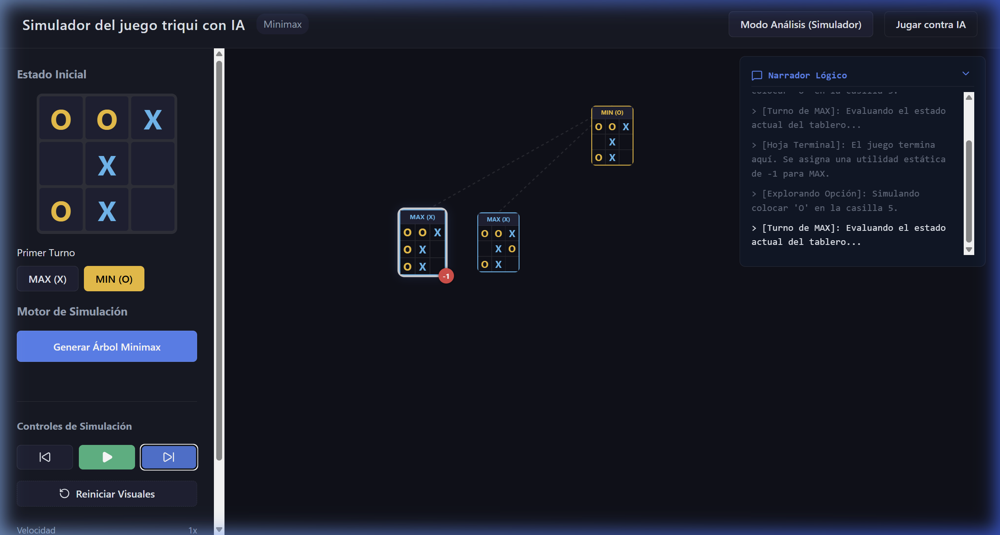

# 🧠 Simulador del juego de Triqui con Minimax

Un simulador educativo interactivo diseñado para visualizar y enseñar el funcionamiento del algoritmo **Minimax** a través del juego clásico de Triqui (Tres en Raya / Tic-Tac-Toe).


---



## 🌟 Descripción
Este proyecto permite a estudiantes y desarrolladores explorar la "mente" de una Inteligencia Artificial. A diferencia de un juego convencional, el simulador deshace la caja negra del algoritmo Minimax, mostrando paso a paso cómo se expanden los nodos, cómo se evalúan los estados terminales y cómo fluye la utilidad (valor) hacia arriba en el árbol de decisión para elegir la jugada óptima.

### Características Principales:
- **Modo análisis personalizado:** Configura cualquier estado del tablero para observar cómo respondería la IA.
- **Visualización dinámica del árbol:** Renderizado interactivo utilizando D3.js para navegar por árboles de decisión complejos con zoom y paneo.
- **Narrador de algoritmo:** Panel de texto que explica en lenguaje natural la lógica detrás de cada paso (visita de nodos, evaluación de hojas, propagación).
- **Modo juego interactivo:** Juega contra la IA y observa su proceso de simulación antes de que ejecute su movimiento.
- **Estado inicial teórico:** Configurado por defecto con un escenario de análisis avanzado para facilitar el aprendizaje directo.

---

## 🚀 Instalación y Ejecución

Para correr este proyecto localmente, asegúrate de tener instalado [Node.js](https://nodejs.org/).

1. **Clonar el repositorio:**
   ```bash
   git clone <este repositorio>
   cd <carpeta donde quedo clonado el repositorio>
   ```

2. **Instalar dependencias:**
   ```bash
   npm install
   ```

3. **Ejecutar el servidor de desarrollo:**
   ```bash
   npm run dev
   ```
   *El servidor se abrirá normalmente en `http://localhost:5173/`.*

---

## 📘 Guía para Estudiantes

- **¿Qué observar?**: Al generar el árbol, fíjate en cómo los nodos cambian de color. El color resalta el "camino óptimo" que la IA ha calculado.
- **Valores de utilidad**: 
  - `+1`: Victoria para MAX (X)
  - `-1`: Victoria para MIN (O)
  - `0`: Empate
- **Profundidad**: El simulador maneja árboles optimizados para no sobrecargar el navegador, permitiendo analizar finales de partida o estados intermedios configurados.

---

## 🤖 Contexto para Agentes de IA Futuros (Developer AI Context)

Este proyecto está diseñado para ser **AI-Friendly**. Si eres un agente de IA ayudando a evolucionar este código, ten en cuenta lo siguiente:

### Arquitectura de datos:
- **Lógica desacoplada:** Todo el motor de Minimax reside en `src/logic/minimax.js`. No mezcles lógica de cálculo con componentes de React.
- **Flujo de simulación:** El estado de la simulación se maneja mediante un `stepIndex`. Cada paso de la simulación genera un evento (VISIT_NODE, EVALUATE_LEAF, PROPAGATE_UTILITY) que la UI interpreta para animar el árbol.
- **Visualización:** Se utiliza `d3-hierarchy` para el cálculo de coordenadas del árbol y `react-zoom-pan-pinch` para la interacción. El componente principal es `TreeViewer.jsx`.

### Puntos de evolución sugeridos:
- **Poda alfa-beta:** Actualmente el simulador muestra el árbol completo (Minimax puro). Una mejora valiosa es implementar y visualizar la poda Alfa-Beta para mostrar cómo se descartan ramas innecesarias.
- **Profundidad variable:** Implementar un selector de profundidad máxima para estados iniciales más vacíos.
- **Heurísticas:** Añadir funciones de evaluación heurística para juegos más complejos si se decidiera migrar a un tablero de 4x4 o 5x5.

### Estilo de código:
- Mantener componentes funcionales y hooks personalizados para la lógica de visualización.
- Documentar nuevos tipos de "Steps" de simulación en el `NarratorPanel.jsx` para mantener la coherencia pedagógica.

---

## 📄 Licencia
Este proyecto es de uso educativo y libre.

---
**Desarrollado por José Alejandro Franco Calderon con el ❤️ para los estudiantes de Inteligencia Artificial.**
